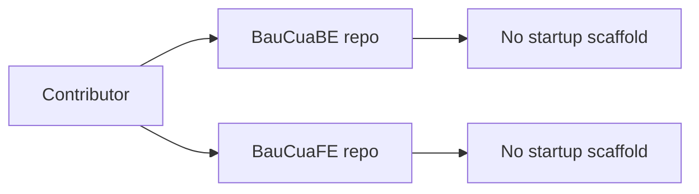
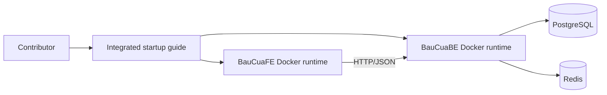

# Architecture Change / Thay doi Kien truc

## Before / Truoc thay doi

## After / Sau thay doi

## Architecture Notes / Ghi chu kien truc

- Backend remains API authority for business logic.
- Frontend remains API consumer.
- Local runtime becomes reproducible and environment-driven via Docker.
