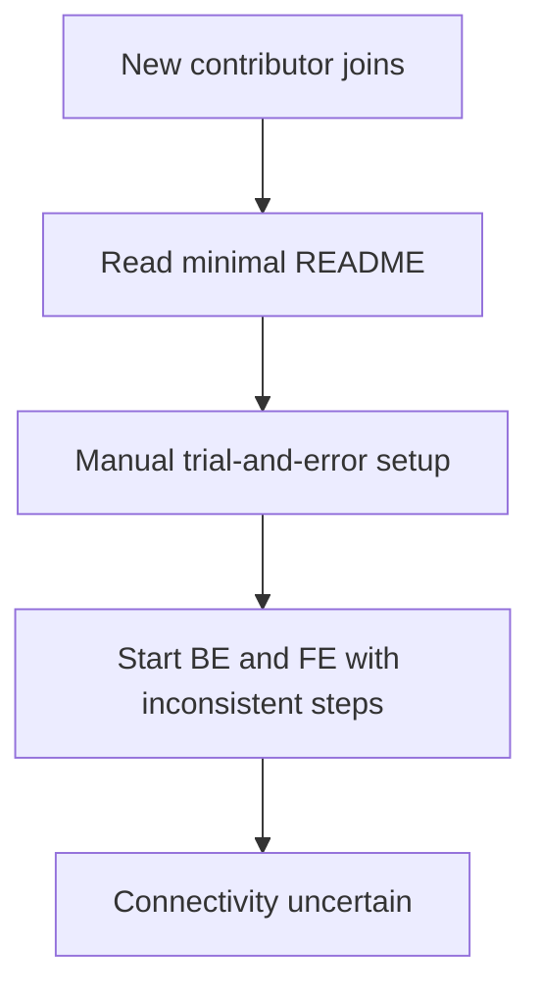
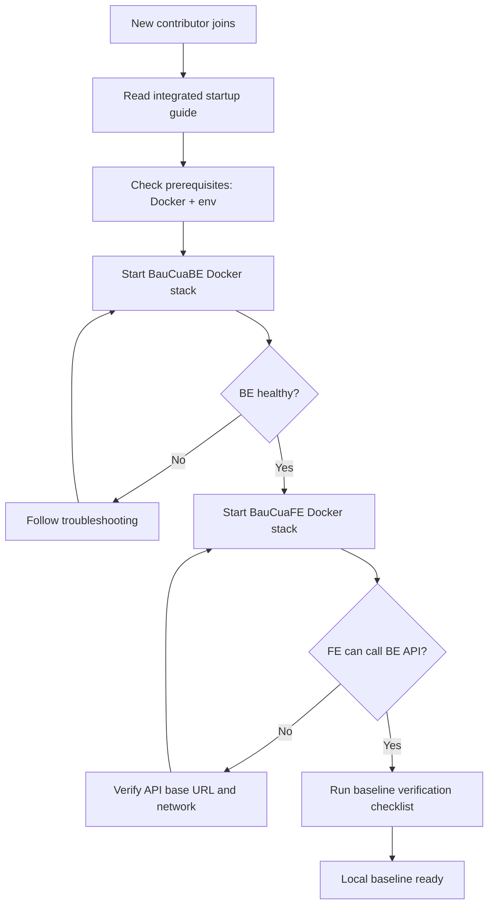

# Flow Overview / Tong quan Luong

## Current Flow / Luong Hien tai

## Proposed Flow / Luong De xuat

## Changes Highlighted / Thay doi Noi bat

- Added: Docker-first startup baseline.
- Added: Explicit startup order BauCuaBE -> BauCuaFE.
- Added: Repeatable FE-BE connectivity verification.
- Removed: Ad hoc manual setup flow.
