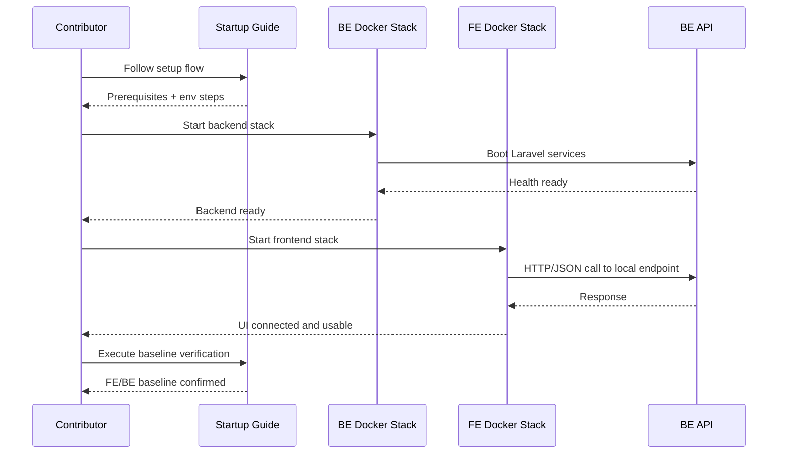

# Sequence: Shared local FE/BE startup baseline

## Notes / Ghi chu

- Startup order is backend first, frontend second.
- Connectivity check is mandatory before marking baseline ready.
- Fail-fast handling is required for missing env and unavailable Docker runtime.
