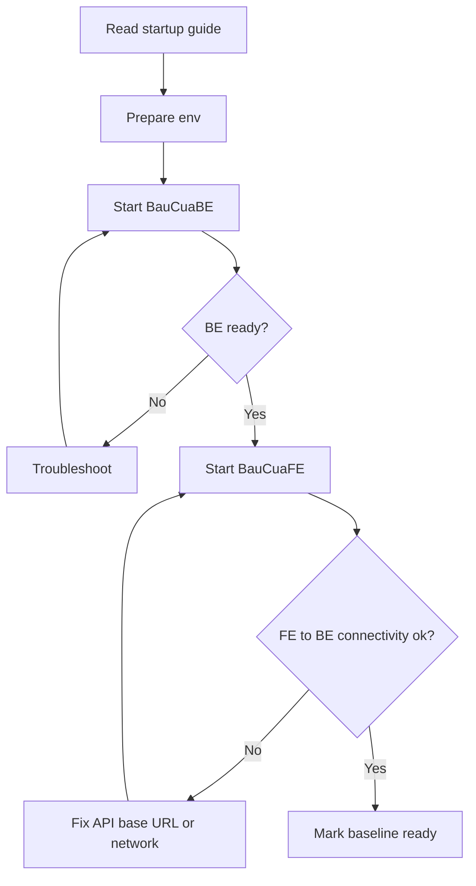

# Specification: Shared local FE/BE startup baseline

# Dac ta: Baseline khoi dong local FE/BE thong nhat

---

## 📋 TL;DR

| Aspect              | Value                                                |
| ------------------- | ---------------------------------------------------- |
| Feature             | US-0.0.1 — Shared local FE/BE startup baseline       |
| Phase 0 Analysis    | [Solution Design](../00_analysis/solution-design.md) |
| Functional Reqs     | 6                                                    |
| Non-Functional Reqs | 5                                                    |
| Affected Roots      | BauCuaBE, BauCuaFE                                   |

---

## 1. Overview / Tong quan

### 1.1 Summary / Tom tat

**EN:** Define a Docker-first, reproducible local startup baseline for both backend and frontend so new contributors can run both roots using one documented flow.

**VI:** Dinh nghia baseline local theo huong Docker, co the lap lai cho ca backend va frontend de thanh vien moi co the chay ca hai root bang mot luong huong dan thong nhat.

### 1.2 Scope / Pham vi

**In Scope / Trong pham vi:**

- Docker-based startup baseline for BauCuaBE and BauCuaFE.
- Clear environment variable contract and setup prerequisites.
- Repeatable baseline verification flow for FE-BE connectivity.
- Linked PR documentation constraints across two repositories.

**Out of Scope / Ngoai pham vi:**

- Gameplay, room, betting, mission, reward features.
- Product business-rule changes.
- Production deployment or infrastructure hardening.

---

## 2. Goals & Non-Goals / Muc tieu va Ngoai muc tieu

### Goals / Muc tieu

**EN:**

1. Provide one documented local startup flow for both roots.
2. Reduce onboarding friction and environment drift.
3. Ensure deterministic FE-BE local connectivity checks.

**VI:**

1. Cung cap mot luong startup local da tai lieu hoa cho ca hai root.
2. Giam ma sat onboarding va sai lech moi truong.
3. Dam bao kiem tra ket noi FE-BE local co tinh xac dinh.

### Non-Goals / Ngoai muc tieu

**EN:**

1. Implement user-facing product features.
2. Replace existing production architecture.

**VI:**

1. Khong trien khai tinh nang san pham cho nguoi dung cuoi.
2. Khong thay doi kien truc production hien tai.

---

## 3. User Stories / User Story

### US-0.0.1: Shared local FE/BE startup baseline

**VI:** La mot thanh vien doi phat trien, toi muon co mot luong khoi dong local thong nhat cho frontend va backend de moi nguoi cung lam viec tren mot baseline.

**EN:** As a development team member, I want one shared local startup flow for frontend and backend so every contributor works on the same baseline.

---

## 4. Requirements Matrix / Ma tran Yeu cau

| ID      | Title                              | Priority | Type            | Covered By |
| ------- | ---------------------------------- | -------- | --------------- | ---------- |
| FR-001  | Unified startup guide              | Must     | Functional      | TC-FR-001  |
| FR-002  | Backend Docker baseline            | Must     | Functional      | TC-FR-002  |
| FR-003  | Frontend Docker baseline           | Must     | Functional      | TC-FR-003  |
| FR-004  | Environment contract               | Must     | Functional      | TC-FR-004  |
| FR-005  | Baseline verification checklist    | Must     | Functional      | TC-FR-005  |
| FR-006  | Troubleshooting and fail-fast flow | Should   | Functional      | TC-FR-006  |
| NFR-001 | Startup performance                | Should   | Performance     | TC-NFR-001 |
| NFR-002 | Security hygiene for local config  | Must     | Security        | TC-NFR-002 |
| NFR-003 | Local scalability baseline         | Could    | Scalability     | TC-NFR-003 |
| NFR-004 | Maintainability of setup docs      | Must     | Maintainability | TC-NFR-004 |
| NFR-005 | Cross-platform compatibility       | Should   | Compatibility   | TC-NFR-005 |

---

## 5. Functional Requirements / Yeu cau Chuc nang

### FR-001: Unified startup guide

| Aspect         | Detail             |
| -------------- | ------------------ |
| Priority       | Must               |
| Affected Roots | BauCuaBE, BauCuaFE |

#### Description / Mo ta

**EN:** The system documentation MUST provide one integrated startup flow that clearly orders backend startup before frontend startup and includes validation checkpoints.

**VI:** Tai lieu he thong BAT BUOC cung cap mot luong startup tich hop, neu ro thu tu khoi dong backend truoc frontend va kem cac diem kiem tra hop le.

#### Acceptance Criteria / Tieu chi Nghiem thu

- [ ] AC1: One startup guide references both roots in a single sequence.
- [ ] AC2: The guide explicitly enforces order BauCuaBE -> BauCuaFE.
- [ ] AC3: The guide includes at least one validation checkpoint after each root startup.

---

### FR-002: Backend Docker baseline

| Aspect         | Detail   |
| -------------- | -------- |
| Priority       | Must     |
| Affected Roots | BauCuaBE |

#### Description / Mo ta

**EN:** BauCuaBE MUST provide a Docker-based local runtime definition sufficient for a contributor to boot backend services and expose a reachable local API endpoint.

**VI:** BauCuaBE BAT BUOC cung cap dinh nghia runtime local dua tren Docker de contributor co the khoi dong dich vu backend va expose endpoint API local co the truy cap.

#### Acceptance Criteria / Tieu chi Nghiem thu

- [ ] AC1: Backend local runtime can be started from a clean environment via documented Docker commands.
- [ ] AC2: A backend health/readiness check is documented and verifiable.
- [ ] AC3: Required backend service dependencies (database/cache where applicable) are declared in local runtime specification.

---

### FR-003: Frontend Docker baseline

| Aspect         | Detail   |
| -------------- | -------- |
| Priority       | Must     |
| Affected Roots | BauCuaFE |

#### Description / Mo ta

**EN:** BauCuaFE MUST provide a Docker-based local runtime definition that can start the frontend and consume the configured local backend API endpoint.

**VI:** BauCuaFE BAT BUOC cung cap dinh nghia runtime local dua tren Docker co the khoi dong frontend va su dung endpoint API backend local da cau hinh.

#### Acceptance Criteria / Tieu chi Nghiem thu

- [ ] AC1: Frontend local runtime can be started from a clean environment via documented Docker commands.
- [ ] AC2: Frontend configuration includes explicit backend API base URL contract for local mode.
- [ ] AC3: A documented check confirms FE can call BE successfully after both stacks are running.

---

### FR-004: Environment contract

| Aspect         | Detail             |
| -------------- | ------------------ |
| Priority       | Must               |
| Affected Roots | BauCuaBE, BauCuaFE |

#### Description / Mo ta

**EN:** Both roots MUST define required environment inputs with clear naming, purpose, and safe defaults/examples for onboarding.

**VI:** Ca hai root BAT BUOC dinh nghia cac input moi truong bat buoc voi ten bien ro rang, muc dich su dung va gia tri mau an toan cho onboarding.

#### Acceptance Criteria / Tieu chi Nghiem thu

- [ ] AC1: Required env variables are listed with description and sample values per root.
- [ ] AC2: The startup guide links to env contract sections for BE and FE.
- [ ] AC3: Missing critical env variables trigger explicit setup failure guidance.

---

### FR-005: Baseline verification checklist

| Aspect         | Detail             |
| -------------- | ------------------ |
| Priority       | Must               |
| Affected Roots | BauCuaBE, BauCuaFE |

#### Description / Mo ta

**EN:** The delivery MUST include a repeatable checklist that verifies end-to-end local readiness for startup sequence, service health, and FE-BE connectivity.

**VI:** Ban giao BAT BUOC bao gom checklist co the lap lai de xac minh do san sang local dau-cuoi cho thu tu startup, suc khoe dich vu va ket noi FE-BE.

#### Acceptance Criteria / Tieu chi Nghiem thu

- [ ] AC1: Checklist steps are executable by a new contributor without ad hoc support.
- [ ] AC2: Checklist includes expected output for success and failure at each major step.
- [ ] AC3: Checklist verifies startup from clean state (no pre-existing build artifacts required).

---

### FR-006: Troubleshooting and fail-fast flow

| Aspect         | Detail             |
| -------------- | ------------------ |
| Priority       | Should             |
| Affected Roots | BauCuaBE, BauCuaFE |

#### Description / Mo ta

**EN:** Setup documentation SHOULD include common startup failures, recovery actions, and failure-stop criteria to reduce onboarding time.

**VI:** Tai lieu setup NEN bao gom cac loi startup pho bien, buoc khac phuc va tieu chi dung som khi loi de giam thoi gian onboarding.

#### Acceptance Criteria / Tieu chi Nghiem thu

- [ ] AC1: Troubleshooting includes at least Docker unavailable, missing env, and FE-to-BE connectivity failures.
- [ ] AC2: Each error scenario maps to a clear recovery action.
- [ ] AC3: The guide states when to stop and request team support.

---

## 6. Non-Functional Requirements / Yeu cau Phi Chuc nang

### NFR-001: Startup performance

| Aspect   | Detail                                                                                                                              |
| -------- | ----------------------------------------------------------------------------------------------------------------------------------- |
| Category | Performance                                                                                                                         |
| Metric   | Cold-start local environment reaches FE+BE ready state in <= 15 minutes on a standard dev machine after prerequisites are installed |
| Target   | 90% of new contributor setups                                                                                                       |

**Description / Mo ta:**

- **EN:** The baseline should be efficient enough for first-time onboarding and repeatable local startup.
- **VI:** Baseline can du nhanh de phuc vu onboarding lan dau va startup local lap lai.

---

### NFR-002: Security hygiene for local config

| Aspect   | Detail                                                       |
| -------- | ------------------------------------------------------------ |
| Category | Security                                                     |
| Metric   | No secrets committed; env examples contain placeholders only |
| Target   | 100% compliance                                              |

**Description / Mo ta:**

- **EN:** Local setup artifacts must protect secrets and avoid leaking credentials in committed files.
- **VI:** Artifact setup local phai bao ve bi mat va tranh ro ri thong tin nhay cam trong file commit.

---

### NFR-003: Local scalability baseline

| Aspect   | Detail                                                                               |
| -------- | ------------------------------------------------------------------------------------ |
| Category | Scalability                                                                          |
| Metric   | Runtime definitions allow independent service restart without full environment reset |
| Target   | Supported for BE/FE services                                                         |

**Description / Mo ta:**

- **EN:** Local baseline should support iterative development by enabling service-level restart and composability.
- **VI:** Baseline local can ho tro phat trien lap bang cach cho phep khoi dong lai theo tung dich vu va de mo rong.

---

### NFR-004: Maintainability of setup docs

| Aspect   | Detail                                                                      |
| -------- | --------------------------------------------------------------------------- |
| Category | Maintainability                                                             |
| Metric   | Startup guide and env contract are versioned, concise, and cross-referenced |
| Target   | 100% docs traceability to US-0.0.1                                          |

**Description / Mo ta:**

- **EN:** Setup documentation should be easy to update and auditable across two repositories.
- **VI:** Tai lieu setup can de cap nhat va co the truy vet ro rang tren hai repository.

---

### NFR-005: Cross-platform compatibility

| Aspect   | Detail                                                                                        |
| -------- | --------------------------------------------------------------------------------------------- |
| Category | Compatibility                                                                                 |
| Metric   | Documented behavior validated on Windows first and includes notes for Linux/macOS equivalence |
| Target   | Windows required; Linux/macOS guidance included                                               |

**Description / Mo ta:**

- **EN:** The baseline must at minimum work on Windows and provide compatibility notes for other major developer platforms.
- **VI:** Baseline toi thieu phai chay tren Windows va co ghi chu tuong thich cho cac nen tang dev pho bien khac.

---

## 7. User Flow / Luong Nguoi dung (developer flow)

| Step | Action                              | System Response                                   | Next Step |
| ---- | ----------------------------------- | ------------------------------------------------- | --------- |
| 1    | Contributor reads startup guide     | Guide lists prerequisites and env setup           | 2         |
| 2    | Contributor starts BE runtime       | BE services boot and readiness check is available | 3         |
| 3    | Contributor starts FE runtime       | FE app boots with configured API base URL         | 4         |
| 4    | Contributor runs baseline checklist | FE-BE connectivity and health are verified        | End       |

### Flow Diagram



---

## 8. Data Models / Mo hinh Du lieu

```yaml
LocalStartupContract:
  roots:
    - BauCuaBE
    - BauCuaFE
  prerequisites:
    docker_engine: required
    docker_compose: required
  startup_order:
    - BauCuaBE
    - BauCuaFE
  verification:
    backend_ready: required
    frontend_ready: required
    connectivity_ready: required

EnvironmentContract:
  backend:
    required_keys:
      - APP_ENV
      - APP_URL
      - DB_CONNECTION
      - DB_HOST
      - DB_PORT
      - DB_DATABASE
      - DB_USERNAME
      - DB_PASSWORD
      - REDIS_HOST
      - REDIS_PORT
  frontend:
    required_keys:
      - VITE_API_BASE_URL
      - VITE_APP_ENV
```

---

## 9. API Contracts / Hop dong API

### API: Backend readiness endpoint (local)

```yaml
endpoint: GET /health (or documented equivalent readiness endpoint)
success_response:
  status: ok
  service: backend
  environment: local
failure_response:
  status: error
  reason: <readiness failure reason>
```

### API: FE-BE connectivity expectation

```yaml
contract:
  from: BauCuaFE
  to: BauCuaBE
  protocol: HTTP/JSON
  requirement:
    - FE local API base URL points to running BE local endpoint
    - Connectivity verified during baseline checklist
```

---

## 10. Edge Cases / Truong hop Bien

| ID     | Scenario                         | Expected Behavior                                        | Priority      |
| ------ | -------------------------------- | -------------------------------------------------------- | ------------- |
| EC-001 | Docker daemon not running        | Guide stops at prerequisite check with remediation steps | Must handle   |
| EC-002 | Missing backend env key          | BE startup fails fast with explicit missing-key guidance | Must handle   |
| EC-003 | Missing frontend env key         | FE startup fails fast with explicit missing-key guidance | Must handle   |
| EC-004 | FE starts before BE              | Guide enforces startup order and re-checks BE readiness  | Must handle   |
| EC-005 | BE ready but FE cannot reach API | Checklist points to API base URL/network validation      | Must handle   |
| EC-006 | Port conflict on local machine   | Startup flow includes port override guidance             | Should handle |

---

## 11. Error Handling / Xu ly Loi

| Error Condition      | User Message                                         | System Action                                                    |
| -------------------- | ---------------------------------------------------- | ---------------------------------------------------------------- |
| Prerequisite missing | "Docker prerequisites are not satisfied"             | Stop flow and show prerequisite setup steps                      |
| Invalid env contract | "Required environment values are missing or invalid" | Fail startup and reference env contract section                  |
| Connectivity failure | "Frontend cannot reach backend API"                  | Keep runtimes running and provide targeted remediation checklist |

---

## 12. Cross-Root Impact / Anh huong Da Root

| Root     | Changes                                                  | Sync Required   |
| -------- | -------------------------------------------------------- | --------------- |
| BauCuaBE | Docker runtime baseline, env contract, startup docs      | Yes (immediate) |
| BauCuaFE | Docker runtime baseline, env contract, connectivity docs | Yes (immediate) |

### Integration Points / Diem Tich hop

**EN:** BauCuaFE consumes BauCuaBE local API endpoint; startup order and endpoint contract must remain aligned across both repos.

**VI:** BauCuaFE tieu thu endpoint API local cua BauCuaBE; thu tu startup va endpoint contract phai dong bo tren ca hai repo.

---

## 13. Dependencies / Phu thuoc

| Dependency         | Type            | Status                   |
| ------------------ | --------------- | ------------------------ |
| Docker Engine      | Service/Runtime | Existing prerequisite    |
| Docker Compose v2  | Service/Runtime | Existing prerequisite    |
| PHP 8.4 + Composer | Runtime         | Required for BE baseline |
| Node.js + npm      | Runtime         | Required for FE baseline |
| PostgreSQL (local) | Service         | Planned in baseline      |
| Redis (local)      | Service         | Planned in baseline      |

---

## 14. Risks & Assumptions / Rui ro va Gia dinh

### Risks

| Risk                                                         | Impact | Mitigation                                           |
| ------------------------------------------------------------ | ------ | ---------------------------------------------------- |
| Environment drift persists due undocumented local exceptions | High   | Enforce one canonical guide and checklist            |
| Linked PR desynchronization between BE and FE                | Medium | Require cross-reference links and coordinated review |
| Startup instructions become stale                            | Medium | Add ownership and update policy in docs              |

### Assumptions

| #   | Assumption                                  | Validated |
| --- | ------------------------------------------- | --------- |
| 1   | Docker is mandatory for local baseline      | Yes       |
| 2   | Delivery uses 2 linked PRs (BE + FE)        | Yes       |
| 3   | Build/start order is BauCuaBE then BauCuaFE | Yes       |
| 4   | Scope remains setup baseline and docs only  | Yes       |

---

## 15. Open Questions / Cau hoi Mo

| #   | Question                  | Status   | Answer         |
| --- | ------------------------- | -------- | -------------- |
| 1   | Is Docker required?       | Resolved | Yes            |
| 2   | One PR or two linked PRs? | Resolved | Two linked PRs |

---

## 16. Notes / Ghi chu

**EN:** This spec intentionally defines WHAT must be delivered for US-0.0.1 and avoids implementation-level HOW details.

**VI:** Dac ta nay chu dong dinh nghia NHUNG GI can ban giao cho US-0.0.1 va tranh di vao chi tiet trien khai HOW.

---

## Approval / Phe duyet

| Role          | Name    | Status  | Date       |
| ------------- | ------- | ------- | ---------- |
| Author        | Copilot | Done    | 2026-03-30 |
| Tech Reviewer | User    | Pending |            |
| Product Owner | User    | Pending |            |

---

## Next Step / Buoc tiep theo

**VI:** Sau khi review spec, chuyen sang Phase 2 Task Planning.

**EN:** After spec review passes, proceed to Phase 2 Task Planning.

### Traceability Reference / Tham chieu Truy vet

**VI:** Trong Phase 3, bang truy vet yeu cau duoc duy tri tai `docs/local-startup/traceability.md` de doi chieu FR/NFR voi artifacts va diem xac minh.

**EN:** In Phase 3, requirement traceability is maintained at `docs/local-startup/traceability.md` to map FR/NFR to concrete artifacts and verification points.
