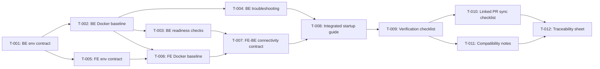

# Task Plan — Shared local FE/BE startup baseline

<!-- Template Version: 1.0 | Contract: v1.0 | Last Updated: 2026-03-30 -->

---

## TL;DR

| Aspect           | Value                                          |
| ---------------- | ---------------------------------------------- |
| Feature          | US-0.0.1 — Shared local FE/BE startup baseline |
| Total Tasks      | 12                                             |
| Estimated Effort | 14.5 hours                                     |
| Affected Roots   | BauCuaBE, BauCuaFE                             |
| Dev Mode         | standard                                       |
| Spec Reference   | ../01_spec/spec.md                             |

---

## 1. Goal

VI: Hoan tat ke hoach task nho, co thu tu phu thuoc ro rang de tao baseline startup local Docker cho ca BauCuaBE va BauCuaFE, kem huong dan va checklist xac minh co the lap lai.

EN: Produce a small, dependency-ordered task plan to deliver a Docker-based local startup baseline for both BauCuaBE and BauCuaFE, including repeatable guidance and verification checklists.

---

## 2. Task Overview

| ID    | Title                                     | Root     | Type   | Est. | Deps        | Status |
| ----- | ----------------------------------------- | -------- | ------ | ---- | ----------- | ------ |
| T-001 | Define backend env contract               | BauCuaBE | Modify | 1.0h | -           | ⏳     |
| T-002 | Add backend Docker runtime baseline       | BauCuaBE | New    | 1.5h | T-001       | ⏳     |
| T-003 | Add backend readiness contract and checks | BauCuaBE | Modify | 1.0h | T-002       | ⏳     |
| T-004 | Add backend troubleshooting matrix        | BauCuaBE | Modify | 1.0h | T-002       | ⏳     |
| T-005 | Define frontend env contract              | BauCuaFE | Modify | 1.0h | T-001       | ⏳     |
| T-006 | Add frontend Docker runtime baseline      | BauCuaFE | New    | 1.5h | T-002,T-005 | ⏳     |
| T-007 | Add FE to BE connectivity contract        | BauCuaFE | Modify | 1.0h | T-003,T-006 | ⏳     |
| T-008 | Write integrated startup guide            | BauCuaBE | New    | 1.5h | T-004,T-007 | ⏳     |
| T-009 | Create baseline verification checklist    | BauCuaBE | New    | 1.0h | T-008       | ⏳     |
| T-010 | Add linked PR sync checklist              | BauCuaBE | New    | 1.0h | T-009       | ⏳     |
| T-011 | Add compatibility and platform notes      | BauCuaBE | New    | 1.0h | T-009       | ⏳     |
| T-012 | Add requirements traceability sheet       | BauCuaBE | New    | 1.0h | T-010,T-011 | ⏳     |

Legend:

- Type: New = create, Modify = change existing, Delete = remove
- Status: ⏳ Pending, 🔄 In Progress, ✅ Done, ❌ Blocked

---

## 3. Execution Flow



---

## 3.5 Parallel Execution Notes

### Parallel Groups

VI: Cac task trong cung group co the chay song song neu giu nguyen dependency chain.

EN: Tasks in the same group can run in parallel while preserving dependency constraints.

| Group | Tasks        | Reason                                              |
| ----- | ------------ | --------------------------------------------------- |
| A     | T-003, T-004 | Same dependency T-002, different files and concerns |
| B     | T-010, T-011 | Same dependency T-009, different output documents   |

### Sequential Constraints

| Sequence       | Reason                                                                              |
| -------------- | ----------------------------------------------------------------------------------- |
| T-002 -> T-006 | Cross-root api-integration: backend runtime must be defined before frontend runtime |
| T-007 -> T-008 | Integrated guide depends on finalized connectivity contract                         |
| T-010 -> T-012 | Traceability must include sync checklist outputs                                    |

### Execution Hint

VI: Day la goi y toi uu hoa; van thuc thi tung task theo thu tu duoc duyet trong flow.

EN: This is an optimization hint; execution remains one-task-at-a-time in approved order.

---

## 4. Task Details

### T-001 — Define backend env contract

| Aspect       | Detail                   |
| ------------ | ------------------------ |
| Root         | BauCuaBE                 |
| Type         | Modify                   |
| Estimated    | S (60 min)               |
| Dependencies | None                     |
| FR Covered   | FR-004, NFR-002, NFR-004 |

Description:

- EN: Define required backend environment keys, descriptions, and safe examples for local Docker startup.
- VI: Dinh nghia bo bien moi truong backend bat buoc, mo ta va gia tri mau an toan cho startup Docker local.

Files:
| Action | Path |
|--------|------|
| Modify | BauCuaBE/.env.example |
| Modify | BauCuaBE/README.md |

Done Criteria:

- [ ] Required backend keys match spec EnvironmentContract.
- [ ] Secrets are represented only by placeholders.

Verification:

- Manual check: key list in .env.example matches spec Section 8.
- Manual check: README links to env section.

---

### T-002 — Add backend Docker runtime baseline

| Aspect       | Detail          |
| ------------ | --------------- |
| Root         | BauCuaBE        |
| Type         | New             |
| Estimated    | M (90 min)      |
| Dependencies | T-001           |
| FR Covered   | FR-002, NFR-003 |

Description:

- EN: Add backend local Docker runtime definition including app, database, and cache service stubs.
- VI: Them dinh nghia runtime Docker local cho backend, gom app, database va cache service.

Files:
| Action | Path |
|--------|------|
| Create | BauCuaBE/docker-compose.local.yml |
| Create | BauCuaBE/Dockerfile |
| Modify | BauCuaBE/README.md |

Done Criteria:

- [ ] Docker runtime files exist and are internally consistent.
- [ ] Service names and ports are documented.

Verification:

- Command: docker compose -f docker-compose.local.yml config
- Check: compose config resolves without schema errors.

---

### T-003 — Add backend readiness contract and checks

| Aspect       | Detail                  |
| ------------ | ----------------------- |
| Root         | BauCuaBE                |
| Type         | Modify                  |
| Estimated    | S (60 min)              |
| Dependencies | T-002                   |
| FR Covered   | FR-002, FR-005, NFR-001 |

Description:

- EN: Document one canonical readiness endpoint and expected success/failure response shape.
- VI: Tai lieu hoa mot readiness endpoint chuan va cau truc response thanh cong/that bai mong doi.

Files:
| Action | Path |
|--------|------|
| Modify | BauCuaBE/README.md |
| Create | BauCuaBE/docs/local-startup/backend-readiness.md |

Done Criteria:

- [ ] Canonical endpoint is explicitly named.
- [ ] Readiness check command and expected output are documented.

Verification:

- Command: curl http://localhost:<be-port>/<health-path>
- Check: response format matches documented contract.

---

### T-004 — Add backend troubleshooting matrix

| Aspect       | Detail          |
| ------------ | --------------- |
| Root         | BauCuaBE        |
| Type         | Modify          |
| Estimated    | S (60 min)      |
| Dependencies | T-002           |
| FR Covered   | FR-006, NFR-004 |

Description:

- EN: Add fail-fast troubleshooting for Docker unavailable, missing env, and local port collisions.
- VI: Bo sung bang troubleshooting fail-fast cho Docker khong san sang, thieu env, va xung dot cong.

Files:
| Action | Path |
|--------|------|
| Create | BauCuaBE/docs/local-startup/troubleshooting.md |
| Modify | BauCuaBE/README.md |

Done Criteria:

- [ ] Each common failure has recovery steps.
- [ ] Stop criteria and escalation path are stated.

Verification:

- Manual review: each error scenario maps to one recovery path.

---

### T-005 — Define frontend env contract

| Aspect       | Detail                   |
| ------------ | ------------------------ |
| Root         | BauCuaFE                 |
| Type         | Modify                   |
| Estimated    | S (60 min)               |
| Dependencies | T-001                    |
| FR Covered   | FR-004, NFR-002, NFR-004 |

Description:

- EN: Define frontend required env keys (including API base URL) with clear examples aligned to backend naming.
- VI: Dinh nghia bien env bat buoc cho frontend (bao gom API base URL) voi vi du ro rang va dong bo ten bien voi backend.

Files:
| Action | Path |
|--------|------|
| Modify | BauCuaFE/.env.example |
| Modify | BauCuaFE/README.md |

Done Criteria:

- [ ] FE env keys are complete and documented.
- [ ] API base URL key is explicit and local-ready.

Verification:

- Manual check: FE env keys align with spec EnvironmentContract frontend.

---

### T-006 — Add frontend Docker runtime baseline

| Aspect       | Detail          |
| ------------ | --------------- |
| Root         | BauCuaFE        |
| Type         | New             |
| Estimated    | M (90 min)      |
| Dependencies | T-002, T-005    |
| FR Covered   | FR-003, NFR-003 |

Description:

- EN: Add frontend local Docker runtime definition for reproducible startup and integration with local backend endpoint.
- VI: Them dinh nghia runtime Docker local cho frontend de startup co the lap lai va tich hop voi endpoint backend local.

Files:
| Action | Path |
|--------|------|
| Create | BauCuaFE/docker-compose.local.yml |
| Create | BauCuaFE/Dockerfile |
| Modify | BauCuaFE/README.md |

Done Criteria:

- [ ] Frontend Docker runtime config is valid.
- [ ] Runtime references FE env contract and API base URL.

Verification:

- Command: docker compose -f docker-compose.local.yml config
- Check: compose configuration resolves.

---

### T-007 — Add FE to BE connectivity contract

| Aspect       | Detail         |
| ------------ | -------------- |
| Root         | BauCuaFE       |
| Type         | Modify         |
| Estimated    | S (60 min)     |
| Dependencies | T-003, T-006   |
| FR Covered   | FR-003, FR-005 |

Description:

- EN: Define explicit FE-to-BE connectivity validation steps and expected pass/fail outputs.
- VI: Dinh nghia ro cac buoc xac minh ket noi FE-to-BE va output pass/fail mong doi.

Files:
| Action | Path |
|--------|------|
| Create | BauCuaFE/docs/local-startup/connectivity.md |
| Modify | BauCuaFE/README.md |

Done Criteria:

- [ ] Connectivity checks depend on backend readiness.
- [ ] API base URL validation rules are documented.

Verification:

- Manual check: connectivity guide references backend canonical readiness endpoint.

---

### T-008 — Write integrated startup guide

| Aspect       | Detail         |
| ------------ | -------------- |
| Root         | BauCuaBE       |
| Type         | New            |
| Estimated    | M (90 min)     |
| Dependencies | T-004, T-007   |
| FR Covered   | FR-001, FR-004 |

Description:

- EN: Create one integrated startup guide that combines prerequisites, startup order, and links to per-root contracts.
- VI: Tao mot startup guide tich hop gom prerequisite, thu tu startup, va lien ket den contract cua tung root.

Files:
| Action | Path |
|--------|------|
| Create | BauCuaBE/docs/local-startup/guide.md |
| Modify | BauCuaBE/README.md |

Done Criteria:

- [ ] Single flow includes both BauCuaBE and BauCuaFE startup steps.
- [ ] Startup order BE -> FE is explicit and mandatory.

Verification:

- Manual walkthrough: a new contributor can follow the guide without external support.

---

### T-009 — Create baseline verification checklist

| Aspect       | Detail          |
| ------------ | --------------- |
| Root         | BauCuaBE        |
| Type         | New             |
| Estimated    | S (60 min)      |
| Dependencies | T-008           |
| FR Covered   | FR-005, NFR-001 |

Description:

- EN: Create a repeatable checklist with expected outputs for startup readiness and FE-BE connectivity validation.
- VI: Tao checklist co the lap lai voi expected outputs cho startup readiness va xac minh ket noi FE-BE.

Files:
| Action | Path |
|--------|------|
| Create | BauCuaBE/docs/local-startup/checklist.md |
| Modify | BauCuaBE/docs/local-startup/guide.md |

Done Criteria:

- [ ] Checklist includes clean-start preconditions.
- [ ] Each major step has success and failure output hints.

Verification:

- Manual check: checklist can be executed end-to-end from clean state.

---

### T-010 — Add linked PR sync checklist

| Aspect       | Detail          |
| ------------ | --------------- |
| Root         | BauCuaBE        |
| Type         | New             |
| Estimated    | S (60 min)      |
| Dependencies | T-009           |
| FR Covered   | FR-001, NFR-004 |

Description:

- EN: Document mandatory linked-PR synchronization gates between BE and FE for this user story.
- VI: Tai lieu hoa cac cong dong bo bat buoc giua linked PR BE va FE cho user story nay.

Files:
| Action | Path |
|--------|------|
| Create | BauCuaBE/docs/local-startup/linked-pr-sync.md |
| Modify | BauCuaBE/docs/runs/bau-cua-online-game/01_spec/cross-root-impact.md |

Done Criteria:

- [ ] Each PR template/checklist references the counterpart PR.
- [ ] Merge readiness requires both PR checks completed.

Verification:

- Manual check: sync checklist contains bi-directional references and gate conditions.

---

### T-011 — Add compatibility and platform notes

| Aspect       | Detail          |
| ------------ | --------------- |
| Root         | BauCuaBE        |
| Type         | New             |
| Estimated    | S (60 min)      |
| Dependencies | T-009           |
| FR Covered   | FR-006, NFR-005 |

Description:

- EN: Add Windows-first compatibility notes plus Linux/macOS equivalence guidance for local startup.
- VI: Bo sung ghi chu tuong thich theo huong Windows-first va huong dan tuong duong cho Linux/macOS.

Files:
| Action | Path |
|--------|------|
| Create | BauCuaBE/docs/local-startup/compatibility.md |
| Modify | BauCuaBE/docs/local-startup/guide.md |

Done Criteria:

- [ ] Windows setup notes are explicit.
- [ ] Linux/macOS notes are documented for equivalent steps.

Verification:

- Manual review: compatibility section covers all prerequisite categories.

---

### T-012 — Add requirements traceability sheet

| Aspect       | Detail                                    |
| ------------ | ----------------------------------------- |
| Root         | BauCuaBE                                  |
| Type         | New                                       |
| Estimated    | S (60 min)                                |
| Dependencies | T-010, T-011                              |
| FR Covered   | NFR-004, FR-001..FR-006, NFR-001..NFR-005 |

Description:

- EN: Create a traceability sheet mapping all requirements to concrete artifacts and verification points.
- VI: Tao bang traceability map toan bo yeu cau voi artifact cu the va diem xac minh.

Files:
| Action | Path |
|--------|------|
| Create | BauCuaBE/docs/local-startup/traceability.md |
| Modify | BauCuaBE/docs/runs/bau-cua-online-game/01_spec/spec.md |

Done Criteria:

- [ ] Every FR and NFR has at least one linked artifact and one verification point.
- [ ] Traceability sheet is referenced from startup guide.

Verification:

- Manual review: no requirement remains unmapped.

---

## 5. Cross-Root Integration Tasks

### T-010 — Integration: BauCuaBE ↔ BauCuaFE

| Aspect       | Detail      |
| ------------ | ----------- |
| Type         | Integration |
| Dependencies | T-009       |

Description:

- VI: Dong bo linked PR checklist va cong dong bo giua hai repo de tranh merge lech pha.
- EN: Synchronize linked-PR checklist and gates between repos to prevent desynchronized merges.

Integration Points:
| From | To | Contract |
|------|----|----------|
| BauCuaFE/docs/local-startup/connectivity.md | BauCuaBE/docs/local-startup/guide.md | FE-BE connectivity steps must align |
| BauCuaBE readiness contract | BauCuaFE runtime docs | FE validation requires BE readiness |

Verification:

- [ ] Integration flow works end-to-end from BE startup to FE connectivity check.
- [ ] Cross-root references are consistent and non-contradictory.

---

## 6. Requirements Coverage

| Requirement | Tasks               | Status |
| ----------- | ------------------- | ------ |
| FR-001      | T-008, T-010, T-012 | ⬜     |
| FR-002      | T-002, T-003        | ⬜     |
| FR-003      | T-006, T-007        | ⬜     |
| FR-004      | T-001, T-005, T-008 | ⬜     |
| FR-005      | T-003, T-007, T-009 | ⬜     |
| FR-006      | T-004, T-011        | ⬜     |
| NFR-001     | T-003, T-009        | ⬜     |
| NFR-002     | T-001, T-005        | ⬜     |
| NFR-003     | T-002, T-006        | ⬜     |
| NFR-004     | T-001, T-010, T-012 | ⬜     |
| NFR-005     | T-011               | ⬜     |

---

## 7. Test Plan

### 7.1 Test Strategy

VI: Chien luoc test cho phase nay tap trung vao static validation, integration verification va startup journey verification. Test code duoc viet o Phase 4 vi dev mode la standard.

EN: The test strategy for this phase focuses on static validation, integration verification, and startup journey verification. Test code is written in Phase 4 because dev mode is standard.

| Type        | Scope                                                  | Coverage Target             |
| ----------- | ------------------------------------------------------ | --------------------------- |
| Unit        | Env key validation rules, checklist parser/helpers     | 80%                         |
| Integration | BE runtime readiness and FE-BE connectivity checks     | Key paths 100%              |
| E2E         | New contributor startup journey from clean environment | Happy path + major failures |

### 7.2 Test Cases by Task

| TC ID  | Task  | Test Description                                              | Type        | Expected Result                                               |
| ------ | ----- | ------------------------------------------------------------- | ----------- | ------------------------------------------------------------- |
| TC-001 | T-001 | Validate BE required env keys are complete and documented     | Unit        | BE env contract matches spec list                             |
| TC-002 | T-002 | Validate BE docker compose config schema                      | Integration | Compose config resolves without errors                        |
| TC-003 | T-003 | Validate canonical readiness endpoint contract                | Integration | Endpoint path and response schema are documented and testable |
| TC-004 | T-004 | Validate troubleshooting maps each BE failure to action       | Unit        | Every listed failure has at least one remediation step        |
| TC-005 | T-005 | Validate FE env keys include API base URL and required values | Unit        | FE env contract complete and aligned with spec                |
| TC-006 | T-006 | Validate FE docker compose config schema                      | Integration | Compose config resolves without errors                        |
| TC-007 | T-007 | Validate FE to BE connectivity contract steps                 | Integration | FE connectivity checks reference BE readiness gate            |
| TC-008 | T-008 | Validate integrated startup guide sequence                    | E2E         | Guide order is BE then FE with checkpoints                    |
| TC-009 | T-009 | Execute baseline checklist from clean state                   | E2E         | Checklist produces pass/fail outputs per step                 |
| TC-010 | T-010 | Validate linked PR sync checklist consistency                 | Unit        | BE and FE checklists cross-reference each other               |
| TC-011 | T-011 | Validate compatibility notes completeness                     | Unit        | Windows notes + Linux/macOS equivalents documented            |
| TC-012 | T-012 | Validate requirement traceability completeness                | Unit        | All FR/NFR mapped to at least one task and verification       |
| TC-013 | T-009 | Simulate FE cannot reach BE scenario                          | Integration | Checklist routes to targeted remediation                      |
| TC-014 | T-004 | Simulate missing env key scenario                             | Integration | Fail-fast guidance is clear and actionable                    |

### 7.3 Edge Cases & Error Scenarios

| TC ID  | Scenario                     | Input                              | Expected Behavior                             |
| ------ | ---------------------------- | ---------------------------------- | --------------------------------------------- |
| TC-E01 | Empty env value              | Empty APP_URL or VITE_API_BASE_URL | Startup blocked with explicit error guidance  |
| TC-E02 | Invalid URL format           | Malformed API base URL             | Connectivity test fails with fix instructions |
| TC-E03 | Docker daemon down           | Docker service unavailable         | Prerequisite step fails-fast and exits setup  |
| TC-E04 | Port already occupied        | Local port conflict                | Alternate port guidance is shown              |
| TC-E05 | BE healthy endpoint mismatch | Wrong health path in FE docs       | Sync checklist catches mismatch before merge  |

### 7.4 Test Data Requirements

```yaml
fixtures:
  backend_env_sample:
    APP_ENV: local
    APP_URL: http://localhost:8000
    DB_CONNECTION: pgsql
    DB_HOST: postgres
    DB_PORT: 5432
    DB_DATABASE: baucua_local
    DB_USERNAME: baucua
    DB_PASSWORD: <placeholder>
    REDIS_HOST: redis
    REDIS_PORT: 6379
  frontend_env_sample:
    VITE_APP_ENV: local
    VITE_API_BASE_URL: http://localhost:8000
```

---

## 8. Risk per Task

| Task  | Risk                                           | Mitigation                                                |
| ----- | ---------------------------------------------- | --------------------------------------------------------- |
| T-002 | Docker definition diverges from FE assumptions | Enforce sync review at T-010                              |
| T-006 | FE runtime ignores BE readiness dependency     | Require T-003 dependency and connectivity contract checks |
| T-009 | Checklist misses a critical failure branch     | Add TC-013 and TC-E scenarios                             |
| T-012 | Requirement mapping becomes stale              | Keep traceability linked from spec and startup guide      |

---

## 8. Rollback Plan

| Task           | Rollback Action                                                            |
| -------------- | -------------------------------------------------------------------------- |
| T-001 to T-004 | Revert BE env/docs changes and restore prior README guidance               |
| T-005 to T-007 | Revert FE env/docs/runtime definitions and restore prior docs              |
| T-008 to T-012 | Revert integrated docs/checklists and keep Phase 1 spec as source of truth |

---

## 9. Environment Requirements

VI: Cac dieu kien can truoc khi bat dau implementation.

EN: Preconditions required before implementation starts.

```env
# Tooling
DOCKER_ENGINE=required
DOCKER_COMPOSE_V2=required

# Backend runtime prerequisites
PHP_VERSION=8.4
COMPOSER=required
POSTGRES_SERVICE=required
REDIS_SERVICE=required

# Frontend runtime prerequisites
NODE_VERSION=required
NPM=required

# API contract
LOCAL_API_BASE_URL=http://localhost:<be-port>
```

---

## 10. Open Questions

VI:

- Khong con cau hoi mo chan implementation.

EN:

- No blocking open questions remain for implementation planning.

---

## Approval

| Role     | Name    | Status  | Date       |
| -------- | ------- | ------- | ---------- |
| Author   | Copilot | Done    | 2026-03-30 |
| Reviewer | User    | Pending | TBD        |

---

## Next Step

VI: Sau khi task plan duoc review/duyet, chuyen sang Phase 3 Implementation voi task dau tien.

EN: After task plan review/approval, proceed to Phase 3 Implementation with the first task.

Reply: approved or revise: <feedback>
